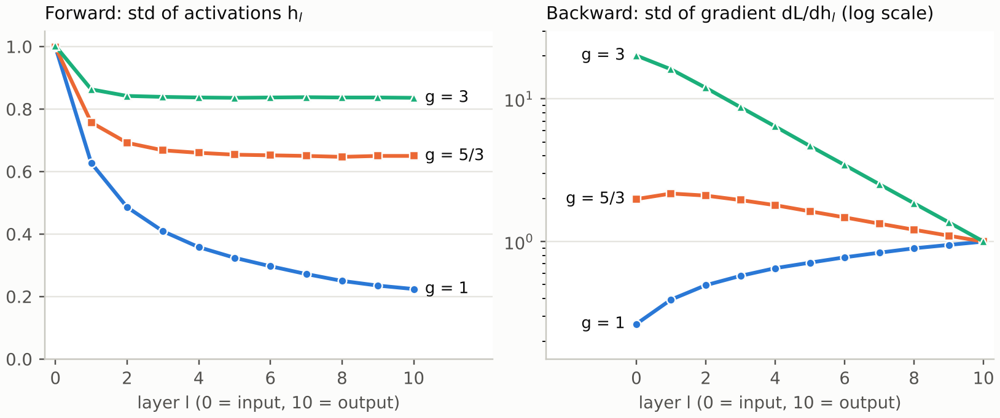

# makemore (3): MLP language model — initialization, saturated tanh, and a mixture with a counting model

Character-level MLP language model (Bengio et al., 2003) trained on a list of names, following Andrej Karpathy's *Neural Networks: Zero to Hero*. These notes document what went wrong at initialization, how it was diagnosed and fixed, and a final experiment that mixes the MLP with a counting model.

**Key results**

- The initial loss was **28.76**, worse than guessing uniformly (log 27 = 3.30). Scaling `W2` by 0.01 and setting `b2 = 0` brought it to **3.30**.
- At the start **67%** of the hidden activations were saturated (|h| > 0.99). The theory predicts it: with `randn` weights and 40 inputs, the pre-activation has std √40 ≈ 6.3. Scaling `W1` by 1/√40 (and the tanh gain 5/3) lowers the predicted saturation to about 1–11%.
- Mixing the MLP with a counting model on 3 characters of context lowers the **test loss from 2.069 to 2.021**.

**Files:** [`makemore_mlp.ipynb`](makemore_mlp.ipynb) (code), [`names.txt`](names.txt) (dataset from [karpathy/makemore](https://github.com/karpathy/makemore), MIT license), [`notes_initialization.pdf`](notes_initialization.pdf) (typeset PDF of the notes below).

---

# 1. The loss we expect, and the first red flag

First of all, we need to think about the loss we expect from a naive model. The next character, irrespective of context (block size), has equal probability of being any of the 27 potential characters. So $p_{\text{naive}}=1/27$. For our loss function: 

$$
-\log p_{\text{naive}}=-\log\frac{1}{27}=\log 27=3.295\approx 3.30
$$

 So when optimizing, the initial loss should be $3.30$; anything bigger means the network wasn’t properly initialized and we need to investigate.

- We run 10 steps of the code with the initial parameters and we print the loss at every step.

$$
i=0:\quad \text{loss}=28.76
$$

 This is a huge red flag, it means that it is giving worse than random probabilities. 

$$
-\log x=28.76\approx 30\;\Longrightarrow\;\log x^{-1}=30\;\Longrightarrow\;x^{-1}=e^{30}\;\Longrightarrow\;x=\frac{1}{e^{30}}\approx 10^{-13}
$$

 This means that on average (geometric mean) $p_{\text{correct}}\approx10^{-13}$, and because the softmax outputs sum to 1, that mass went somewhere else. Within each sample, nearly all of it sat on one or a few wrong characters.

# 2. Fixing $W_2$

So what we want is to have small values for all $-\log x$, that is, to avoid very small $x$. Since $\text{logits}=hW_2+b_2$, to avoid small $x$ we need to make $hW_2+b_2$ small (all logits close to $0$), which is easily achievable by multiplying $W_2$ with $0.01$ and $b_2$ with $0$. Since $b_2$ is the bias of the model for the next character, before any training, making it $0$ means (together with the small $W_2$) assigning equal probability to every character, which was our intention.

We make the corrections in the code:

```python
W2 = torch.randn((200,27), generator=g) * 0.01
b2 = torch.randn(27, generator=g) * 0.00
```

and we print again the first loss (after running for 10 steps): 

$$
i=0:\quad \text{loss}=3.298
$$

 Now we are correctly initializing the weights, which give us equal probability for each character before the training. The loss went from $28.76$ to $\sim3.30$ in the first step.

# 3. Is the network saturated?

For the next step, we want to see if the network is saturated. Saturation is a condition of $\tanh(a)$, where $\lvert h\rvert =\lvert \tanh(a)\rvert \approx1$, which happens when $a$ becomes big, and that creates problems with the gradient in the backward pass. As we saw from the micrograd, the local derivative equals $1-h^2$, so when $h\to\pm1$, the derivative goes to $0$. So the gradient that passes from there is multiplied with something close to $0$ and fades. This is one of the reasons for the case of vanishing gradient.

To check this we add a diagnostics section in the training code after the forward pass section:

```python
print(i, loss.item(), (h.abs()>0.99).float().mean().item())
```

This will give us the percentage of the activations in the hidden layer that are close to $\pm1$ ($\lvert h\rvert >0.99$):

|   step   | loss | $\lvert h\rvert >0.99$ pct |
|:--------:|:----:|:--------------------------:|
|    0     | 3.33 |            0.67            |
|    1     | 3.27 |            0.66            |
| $\vdots$ |      |                            |

We can see that in all steps $\sim66\%$ of the activations are stuck near $\pm1$. Even though the loss is properly initialized, the network is expected not to learn very well because of the vanishing gradient that propagates through the beginning ($W_1,b_1,C$).

# 4. Why does $a$ become big?

For $h=\tanh(a)$ to be $\pm1$, $a$ needs to be big. We now investigate what causes $a$ to become big: 

$$
a=C\cdot W_1+b_1,\qquad C\text{ acts like }X\text{ in our MLP architecture}
$$

 $C,W_1$ are matrices, so we have a sum, the usual one in MLP: $C\cdot W_1=\sum_i C_i\cdot W_{1,i}$.

$C_i,W_{1,i}$ are independent (approximately for $C_i$: the same character in two positions shares one row of $C$) and both $\sim N(0,1)$, since by construction they are drawn from a normal distribution:

```python
C  = torch.randn((27,10), generator=g)
W1 = torch.randn((40,200), generator=g)
```

We take the variance of $a$, to find out how big the terms are (the terms have zero mean and are independent, so the variances of the products and of the sum factor and add): 

$$
\begin{aligned}
\mathrm{Var}(a)&=\mathrm{Var}\Bigl(\sum_i c_i w_i\Bigr)+\mathrm{Var}(b_1)
=\sum_i\mathrm{Var}(c_i w_i)+\mathrm{Var}(b_1)\\
&=\sum_i\mathrm{Var}(c_i)\mathrm{Var}(w_i)+\mathrm{Var}(b_1)
=n\,\mathrm{Var}(c_i)\mathrm{Var}(w_i)+\mathrm{Var}(b_1)\;\approx\;n\,\mathrm{Var}(c_i)\mathrm{Var}(w_i)
\end{aligned}
$$

 The term $n\mathrm{Var}(w)\mathrm{Var}(c)$ grows with $n$, while $\mathrm{Var}(b)$ doesn’t. For big $n$, the first term dominates.

# 5. How big is $a$?

In our case, 10 features for 4 context chars (block size), so $n=40$: 

$$
\mathrm{Var}(a)=40\cdot1\cdot1=40
$$

 

$$
\mathbb{E}[a]=\mathbb{E}[C\cdot W_1]+\mathbb{E}[b_1]=\mathbb{E}[C]\cdot\mathbb{E}[W_1]+\mathbb{E}[b_1]=0\cdot0+0=0
$$

 So we have 

$$
a\sim N(0,\,6.3^2)
$$

 (approximately: $a$ is a sum of 40 terms, so by the central limit theorem it is close to normal).

Since we were trying to find when $a$ becomes big, and now we have the distribution of $a$, we will try to find the range of the most common values (as in a percentile). Before we do this we need to find which values of $a$ send $\tanh(a)$ to $1$:

| $a$ | $\tanh(a)$ | derivative |
|:---:|:----------:|:----------:|
| 0.5 |    0.46    |    0.79    |
|  1  |    0.76    |    0.42    |
|  2  |    0.96    |    0.07    |
|  4  |   0.999    |   0.001    |

$\tanh$ is monotone, so increasing values of $a$ give even smaller derivative. Any values above 2 (included) make the gradient very small, almost $0$. We now find out how common these are: 

$$
P(\lvert a\rvert >2)=P\!\left(\left\lvert \frac{a-0}{6.3}\right\rvert >\frac{2}{6.3}\right)=P(\lvert Z\rvert >0.32)
$$

 From the normal distribution tables we get: 

$$
P(\lvert Z\rvert >0.32)=1-P(\lvert Z\rvert <0.32)\approx1-0.25=0.75
$$

 When $\mathrm{std}\approx6.3$ (our case), almost $75\%$ of the values of $a$ are outside of $[-2,2]$, which is the area where the derivative of $\tanh(a)$ is below $0.07$.

# 6. Fixing $W_1$

We can easily fix that by multiplying $W_1$ by $1/\sqrt{40}$, or in general by $1/\sqrt{\text{number of inputs}}$, which for this example is $n_{\text{in}}=(\text{block size})\cdot(\text{number of features of the embeddings})$. 

$$
W_1'=W_1\cdot\frac{1}{\sqrt{40}}\;\Longrightarrow\;\mathrm{Var}(W_1')=\Bigl(\frac{1}{\sqrt{40}}\Bigr)^{2}\mathrm{Var}(W_1)=\frac{\mathrm{Var}(W_1)}{40}
$$

 So

$$
\mathrm{Var}(a)=n\cdot\mathrm{Var}(c_i)\cdot\mathrm{Var}(w_i')=40\cdot1\cdot\frac{1}{40}=1
\;\Longrightarrow\;
a\sim N(0,1)
$$

and therefore

$$
P(\lvert a\rvert >2)=0.0455=4.55\%
$$

This way less than $5\%$ of the values of $a$ are outside of $[-2,2]$, where $\tanh(a)$ is getting close to $\pm1$ and the derivative drops below $0.07$. (Only $0.8\%$ of them reach $\lvert h\rvert >0.99$, which is what the diagnostic line counts, since $\lvert h\rvert >0.99\iff\lvert a\rvert >2.65$.)

# 7. How the std propagates through layers

## 7.1 One layer: the factor $c$

Take one layer with $n$ inputs. Neuron $j$ computes 

$$
a_j=\sum_{i=1}^{n} h_i\,w_{ij}\;(+\,b_j).
$$

 With zero-mean, independent terms, the variances add (same computation as for $a=C\cdot W_1+b_1$ in section 4): 

$$
\mathrm{Var}(a)=n\,\mathrm{Var}(h)\,\mathrm{Var}(w)
\quad\Longrightarrow\quad
\mathrm{std}(a)=\underbrace{\sqrt{n\,\mathrm{Var}(w)}}_{c}\;\mathrm{std}(h).
$$

 So one layer multiplies the std of its input by one constant, $c=\sqrt{n\mathrm{Var}(w)}$. For `randn` weights $c=\sqrt{n}$ (for $n=40$ that is $6.3$, the number we found). For `randn`$/\sqrt n$ weights $c=1$.

## 7.2 Many layers: where $\mathrm{std}(h_0)$ comes from

The output of a layer is the input of the next one. We write $h_0$ for the very first input and $h_1,h_2,\dots$ for the outputs of layers $1,2,\dots$ Now we apply the rule from above layer by layer, and each time we replace the previous std with the line above it: 

$$
\begin{aligned}
\mathrm{std}(h_1)&=c\cdot\mathrm{std}(h_0)\\
\mathrm{std}(h_2)&=c\cdot\mathrm{std}(h_1)=c\cdot\bigl(c\cdot\mathrm{std}(h_0)\bigr)=c^2\,\mathrm{std}(h_0)\\
\mathrm{std}(h_3)&=c\cdot\mathrm{std}(h_2)=c\cdot\bigl(c^2\,\mathrm{std}(h_0)\bigr)=c^3\,\mathrm{std}(h_0)\\
&\;\;\vdots\\
\mathrm{std}(h_L)&=c^{L}\,\mathrm{std}(h_0)
\end{aligned}
$$

 Two things to see here.

- The exponent is $L$ because every layer contributes exactly one factor $c$, and the factors are multiplied because each layer acts on the output of the previous one, not on the original input.

- $\mathrm{std}(h_0)$ stays at the front because layer 1 is the only layer that reads $h_0$ directly. Layers $2,3,\dots$ never see it, they only see the output of the layer before, and that output was already “$c\times$ (something that contains $h_0$)”. Unrolling the recursion just walks this chain back to its start. It is the same as a bank account: after $L$ years the balance is $r^{L}\times$ the first deposit, because each year’s balance is built from the previous year’s.

Example with $c=0.4$: after layers $1,\dots,5$ the std is $0.4,\;0.16,\;0.064,\;0.026,\;0.010$ times $\mathrm{std}(h_0)$. With $c=1$ it stays equal to $\mathrm{std}(h_0)$ at every depth, which is what we want from an initialization.

The backward pass is the same kind of chain. By the chain rule, 

$$
\frac{\partial L}{\partial h_{l-1}}=\Bigl(\frac{\partial L}{\partial h_{l}}\odot(1-h_l^{2})\Bigr)W^{T},
$$

 so going backwards each layer multiplies the gradient by another factor (the $W^T$ part and the tanh derivative part), and $L$ layers give $L$ factors. If the factor is below 1 the gradient vanishes, if it is above 1 it explodes.

**Caveat.** $c$ is a constant only for a linear layer. With tanh the effective factor depends on how big the signal is (next section), so the decay is not exactly $c^L$. The table in section 10 shows the real numbers.

# 8. What tanh does to the variance

The layer is $h_{\text{next}}=\tanh(a)$, not just $a$. Since $a$ is symmetric around 0 and $\tanh$ is odd, $\mathbb{E}[\tanh(a)]=0$, so 

$$
\mathrm{Var}(h)=\mathbb{E}[h^2]-(\mathbb{E}[h])^2=\mathbb{E}[\tanh^2(a)],\qquad \mathrm{Var}(a)=\mathbb{E}[a^2].
$$

 Both are averages over the same distribution of $a$, only the function differs ($\tanh^2x$ instead of $x^2$). For every $x$ we have $\lvert \tanh x\rvert \le\lvert x\rvert$, therefore 

$$
\mathrm{Var}(h)=\mathbb{E}[\tanh^2(a)]\;\le\;\mathbb{E}[a^2]=\mathrm{Var}(a).
$$

 So tanh can only shrink the variance. How much depends on the size of $a$: for small $a$, $\tanh x\approx x$ and nothing changes; for large $a$, $\tanh^2x\to1$ and $\mathrm{Var}(h)\to 1$ no matter how large $\mathrm{Var}(a)$ is (this is the saturation). For $a\sim N(0,1)$ the integral has no closed form, numerically 

$$
\mathbb{E}[\tanh^2(a)]=\int\tanh^2(x)\,\tfrac{1}{\sqrt{2\pi}}e^{-x^2/2}\,dx\approx0.394
\quad\Rightarrow\quad
\mathrm{std}(h)\approx0.628 .
$$

# 9. The gain: choosing $g$ so a layer does not shrink the signal

A hidden layer with weights $W\cdot\frac{1}{\sqrt n}$ has $c=1$. One full layer is then “matrix $\times$ tanh”, and the tanh shrinks the std. To compensate we multiply the weights by a gain $g$, so $c=g$. Say the signal entering the layer has std $s$ and we want the signal leaving it to have the same std $s$. For $a\sim N(0,1)$ the tanh turns std 1 into $0.628$, so $s=0.628$ must be turned into $\mathrm{std}(a)=1$ by the matrix, which needs 

$$
g\cdot 0.628=1\quad\Longrightarrow\quad
\,g=\frac{1}{\mathrm{std}(\tanh(a))}\approx1.59\,\qquad a\sim N(0,1).
$$

 The value used in practice is $5/3=1.667$ (`torch.nn.init.calculate_gain('tanh')`, the one Karpathy uses). It is a rounded version of this number, so it is computed, not guessed, but it is not exactly $1.59$. In the simulation below the signal settles at $\mathrm{std}(h)=0.628$ for $g=1.59$ and $0.652$ for $g=5/3$.

# 10. Experiment: 10 tanh layers

Setup: width 200, batch 2000, input `randn` (so $\mathrm{std}(h_0)=1$), weights `randn`$/\sqrt{200}\cdot g$, no biases. For the backward pass we start with a random gradient of std 1 at the output and push it back through the layers.



|         | $\mathrm{std}(h_{10})$ | saturated ($\lvert h\rvert >0.99$) at layer 10 | $\mathrm{std}(\partial L/\partial h_0)\,/\,\mathrm{std}(\partial L/\partial h_{10})$ |
|:--------|:----------------------------:|:----------------------------------------------:|:------------------------------------------------------------------------------------------------:|
| $g=1$   |             0.22             |                      0.0%                      |                                               0.26                                               |
| $g=5/3$ |             0.65             |                      1.4%                      |                                               1.99                                               |
| $g=3$   |             0.84             |                     28.9%                      |                                               20.2                                               |

What we see:

- $g=1$: the activations shrink at every layer, to $0.22$ after 10 layers, and the gradient shrinks too ($0.26$). The decay is slower than $c^L$ because when the signal is small tanh is almost linear and shrinks less, but it keeps going down.

- $g=5/3$: the forward std settles at about $0.65$ and stays there. This is the whole point of the gain.

- $g=3$: the forward std is also constant ($0.84$), but 29% of the activations sit in the saturated zone, and the gradient grows $\times20$.

- Backward with $g=5/3$ is not perfectly flat: the gradient std grows about $2\times$ over 10 layers (roughly $\times1.07$ per layer). The gain comes from the forward requirement, the backward pass is only approximately balanced by it.

# 11. What this means for our model

Our makemore model has only *one* tanh layer, and its output $h$ goes into $W_2\cdot0.01$. There is no chain of layers, so the stabilizing role of $5/3$ cannot show up here, that is what the 10-layer experiment is for. What we can check is the first layer, whose input is the embeddings (std 1, not a tanh output): 

$$
\mathrm{std}(a)=g\cdot\sqrt{n\mathrm{Var}(w)}\cdot\mathrm{std}(C)=g\cdot1\cdot1 .
$$

|                                       | $\mathrm{std}(a)$ | $P(\lvert a\rvert >2)$ | $P(\lvert h\rvert >0.99)$ |     measured     |
|:--------------------------------------|:-----------------------:|:----------------------:|:-------------------------:|:----------------:|
| `randn` (before)                      |           6.3           |          75%           |            68%            | 0.67 (section 3) |
| $\times\frac1{\sqrt{40}}$             |           1.0           |          4.6%          |           0.8%            |   not measured   |
| $\times\frac1{\sqrt{40}}\cdot\frac53$ |          1.67           |          23%           |            11%            |   not measured   |

The first three columns come from theory and a simulation of this exact setup ($n=40$); the $0.67$ in the last column is the value we measured in section 3. The two corrected versions have not been measured yet. Both are far from the $67\%$ we started with. The final model uses $5/3$ because it is the standard gain for tanh and matters as soon as layers are stacked.

# 12. Combining the MLP with a counting model

**Setup.** The MLP has block size 4, embedding dimension 10, 200 hidden units and 13 897 parameters. It was trained for 300k steps with batch size 32 and learning rate $0.1$ for the first 100k steps, $0.01$ after. The initialization is the one derived above: $W_1\cdot\frac{5/3}{\sqrt{40}}$, $b_1\cdot0.01$, $W_2\cdot0.01$, $b_2=0$.

The counting model is built from the training split only. For a context of the last $k$ characters, 

$$
P(\text{next}\mid\text{context})=\frac{\text{count}(\text{context},\text{next})+\alpha}{\text{count}(\text{context})+27\alpha}.
$$

 $k$ and $\alpha$ were chosen on the dev split. The mixture is 

$$
p=\lambda\,p_{\text{MLP}}+(1-\lambda)\,p_{\text{count}},
$$

 with $\lambda$ also chosen on dev. The test split was evaluated once, with all three values fixed.

| Model                                | dev NLL |   test NLL   |
|:-------------------------------------|:-------:|:------------:|
| MLP (block size 4)                   |  2.078  |    2.069     |
| Counting model ($k=3$, $\alpha=0.1$) |  2.113  | not measured |
| Mixture ($\lambda=0.6$)              |  2.032  |    2.021     |

Counting model alone on dev, with the best $\alpha$ for each context length:

| context length $k$ |   1   |   2   |   3   |   4   |
|:-------------------|:-----:|:-----:|:-----:|:-----:|
| dev NLL            | 2.456 | 2.231 | 2.113 | 2.154 |

With $k=4$ there are $27^4=531{,}441$ contexts for 182k training examples, so most contexts are too sparse and $k=3$ wins.

**Result.** The mixture lowers the loss by about $0.048$ on test, so the correct next character gets about $5\%$ more probability (geometric mean). The gain on dev is almost the same ($0.046$), so $\lambda$ is not overfitted to dev.

**Caveats.** This is a single training run and the minibatch sampling has no fixed seed, so differences below about $0.02$ are within run-to-run noise (the same MLP had dev loss $2.063$ in an earlier run). A likely explanation is that the counting model is accurate on frequent patterns while the MLP generalizes better to rare ones, so their errors are partly different. We did not test this per sample.
